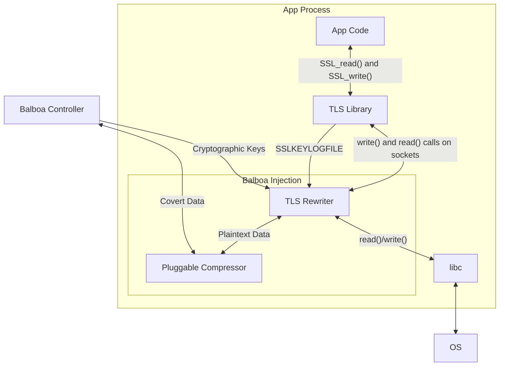
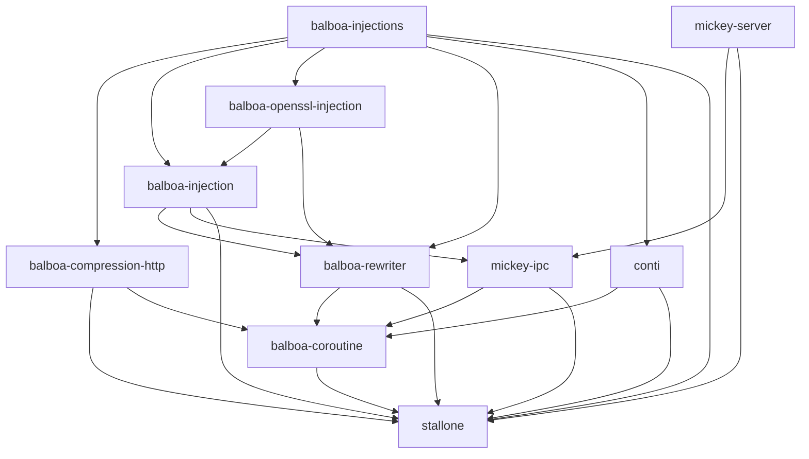
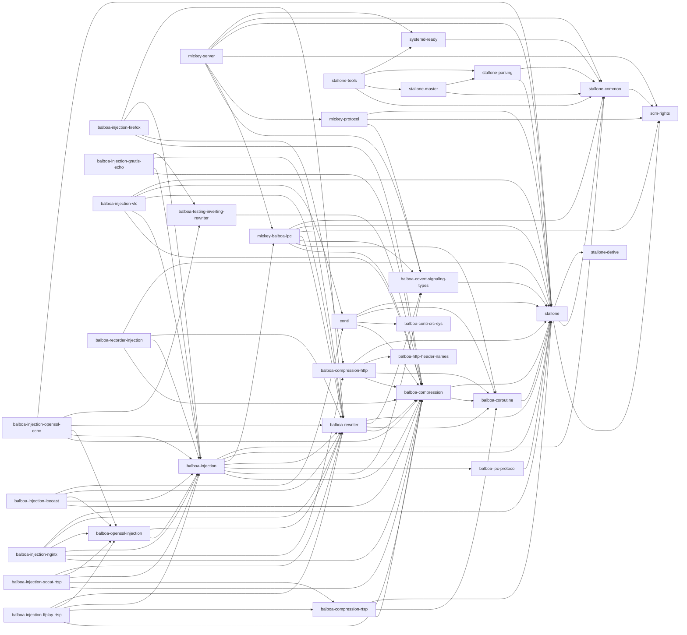

---
title: "Balboa"
...
Balboa is a framework for censorship circumvention. [It was published at USENIX security 2021](https://www.usenix.org/conference/usenixsecurity21/presentation/rosen).

The Balboa source code is _prototype software_. It was written to demonstrate the viability of the Balboa approach.
# Components of Balboa
The Balboa framework is broken up into several different software components

## Software Components Dependency Graph

## Full Crate Dependency Graph
